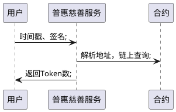
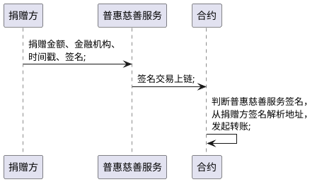
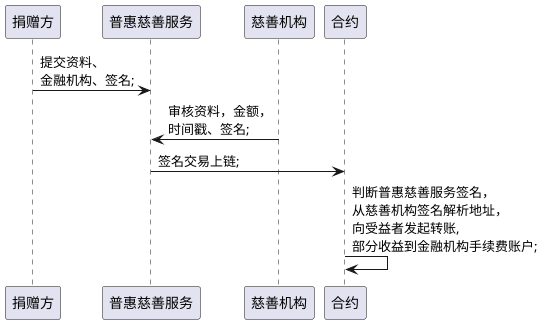

## 1. 概述
本系统主要为慈善基金的链上管理及流转系统，利用区块链公开透明、不可篡改等特点，实现慈善基金的透明管理、缩短慈善基金申领流程。
本系统只涉及资金相关的捐赠与援助，不考虑物资捐赠。

## 2. 角色

### 2.1. 业务角色
* 公益机构
* 金融机构：本地demo不涉及
* 捐赠方
* 受捐赠方
* 监管方

### 2.2. 系统角色
* 共识节点：一般由公益机构担任，出块涉及矿工费。
* 观察者节点：一般为监管机构、热心公益的企业或个人，以便于合规监管及公众的监督

## 3. 业务场景

默认用户登录系统时候会统一生成公私钥。本系统不再提供公私钥生成功能。
demo中默认包含：
* 捐赠者用户名、公私钥
* 受益者用户名、公私钥
* 普惠慈善服务公私钥
* 公益机构公私钥

### 3.1. 一般捐赠
指`捐赠方`向`公益机构`直接进行资金捐赠

### 3.2. 统筹援助
由`公益机构`对收到的资金进行统筹管理及分配，`公益机构`主动对有困难需要援助的个人或是机构进行慈善基金的分配

### 3.3. 申请援助
由`受捐赠方`主动向`公益机构`发起申请，并提供相应的证明材料

## 接口
### 捐赠接口
  - URL: api/donate （POST）
  - parameter: {timestamp:"","balance" : "", "toAddress":"",sign":""}

  - response: {"returnCode":17000, "returnDesc":"success", "data":"{"blockchainNo":"XXXX","txhash":"XXXX","txTime":"XXXX","balance":"XXXX"}"}

签名原文为:"timestamp"+timestamp+"balance"+balance+"toAddress"+toAddress

#### 证书生成
是否复用上一接口返回值

#### 申请救助

  - URL: /api/aidApply （POST）
  - parameter: {timestamp:"", "balance" : "", "context":"", sign":""}
  - response: {"returnCode":17000, "returnDesc":"sucess", "data":""}

#### 金额查询接口

  - URL: /api/balanceQuery （POST）

  - parameter: {timestamp:"", sign":""}

  - response: {"returnCode":17000, "returnDesc":"sucess", "data":"XXXX"}
  //balance数额放入data

#### 受益人申请提现

  - URL: /api/withdrawApply（POST）

  - parameter: {timestamp:"", "balance":"", "context":"", sign":""}

  - response: {"returnCode":17000, "returnDesc":"sucess", 
                "data":""
              }

#### 救助审核

  - URL: /api/aidCheck（POST）

  - parameter: {timestamp:"", "balance" : "", "toAddress":"", sign":""}

  - response: {"returnCode":17000, "returnDesc":"sucess", 
                "data":""}

#### 提现审核

  - URL: /api/withdrawCheck（POST）

  - parameter: {timestamp:"", "balance" : "", "aidTraget":"", sign":""}

  - response: {"returnCode":17000, "returnDesc":"sucess", 
                "data":""}

## 4. 关键数据流
### 4.1. 查询

### 4.2. 捐赠

### 4.3. 援助

### 4.4. 援助

### 4.5. 定向捐赠

### 4.6. 证书生成
任意`捐赠方`都会收到由区块链生成的，包含区块信息及捐赠数据的证书。

## 5. 合约设计

### 5.1. 数字货币生成

### 5.2. 数字货币销毁

### 5.3. 数字货币转账

